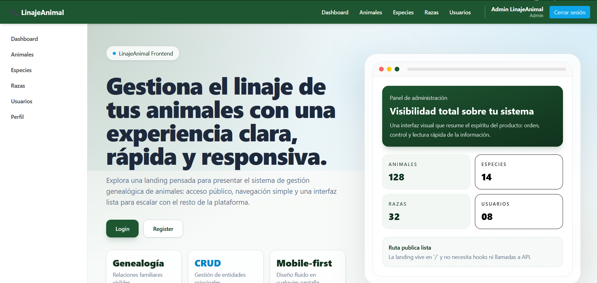
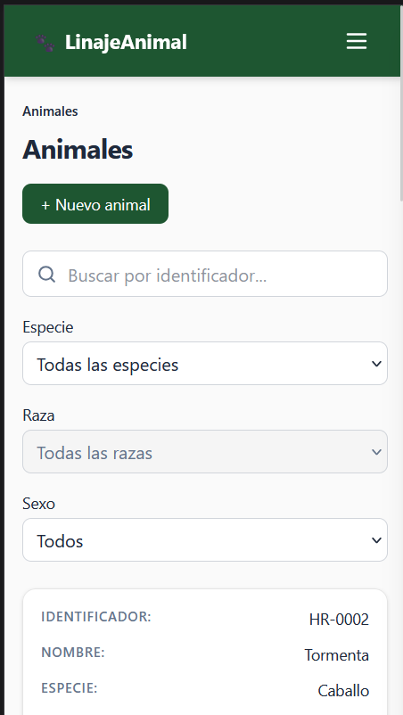

# LinajeAnimal Frontend

Aplicación web para la gestión de un **árbol genealógico de animales**, desarrollada como frontend en React que consume la API REST de `linajeanimal-api`.

## Tecnologías

| Capa | Tecnología | Versión |
|------|-----------|---------|
| Framework | React | ^19.2.7 |
| Bundler | Vite | ^8.1.0 |
| Routing | React Router DOM | ^7.18.0 |
| HTTP Client | Axios | ^1.18.1 |
| Estilos | Tailwind CSS | v4 |
| Linter | ESLint | ^10.5.0 |

## Requisitos

- Node.js 18+
- Backend `linajeanimal-api` corriendo localmente (Docker) o desplegado

## Instalación y ejecución

```bash
# Clonar el repositorio
git clone https://github.com/Lucas-Santamria390/linajeanimal-frontend.git
cd linajeanimal-frontend

# Instalar dependencias
npm install

# Copiar variables de entorno
cp .env.example .env

# Iniciar en desarrollo
npm run dev
```

El frontend queda disponible en `http://localhost:5173`, y espera que el backend (`linajeanimal-api`) esté corriendo en `http://localhost:3000` (ver variable `VITE_API_URL` abajo).

## Variables de entorno

| Variable | Descripción | Valor por defecto |
|---|---|---|
| `VITE_API_URL` | URL base de la API REST | `http://localhost:3000/api/v1` |

## Scripts disponibles

```bash
npm run dev      # Servidor de desarrollo con HMR
npm run build    # Build de producción → dist/
npm run preview  # Vista previa del build
npm run lint     # ESLint
```

## Arquitectura

```
Página → Custom Hook → Servicio (Axios) → API Backend
                       ↕
                 AuthContext (token en localStorage)
```

### Flujo de autenticación

1. Usuario ingresa credenciales en `/login`
2. `AuthContext.login()` envía POST a `/auth/login`
3. Backend valida y devuelve `{ success, data: { usuario, token } }`
4. Token se guarda en `localStorage`
5. Axios interceptor agrega `Authorization: Bearer <token>` a cada request
6. Si el backend responde 401, el interceptor limpia el storage y redirige a `/login`
7. `ProtectedRoute` verifica `isAuthenticated` antes de renderizar rutas privadas

Las rutas privadas están protegidas por `ProtectedRoute` que redirige a `/login` si no hay token. Las rutas exclusivas de administrador (ej. `/usuarios`) además están protegidas por `AdminRoute`.

## Credenciales de prueba

| Rol | Email | Contraseña |
|---|---|---|
| Administrador | `admin@linajeanimal.test` | `Admin123!` |
| Usuario | `usuario@linajeanimal.test` | `User123!` |

> El rol **admin** tiene CRUD completo sobre animales, especies, razas y usuarios. El rol **user** tiene CRUD solo sobre sus propios animales y lectura de especies/razas.

## Capturas de pantalla

<!-- TODO: reemplazar con capturas reales del proyecto corriendo -->

### Vista de escritorio (PC)



### Vista móvil



## Enlaces

- **Repositorio (frontend):** https://github.com/Lucas-Santamria390/linajeanimal-frontend
- **Frontend desplegado (Vercel):** _(pendiente)_
- **Repositorio API:** https://github.com/Lucas-Santamria390/linajeanimal-api
- **API desplegada (Render):** https://linajeanimal-api.onrender.com/api/v1